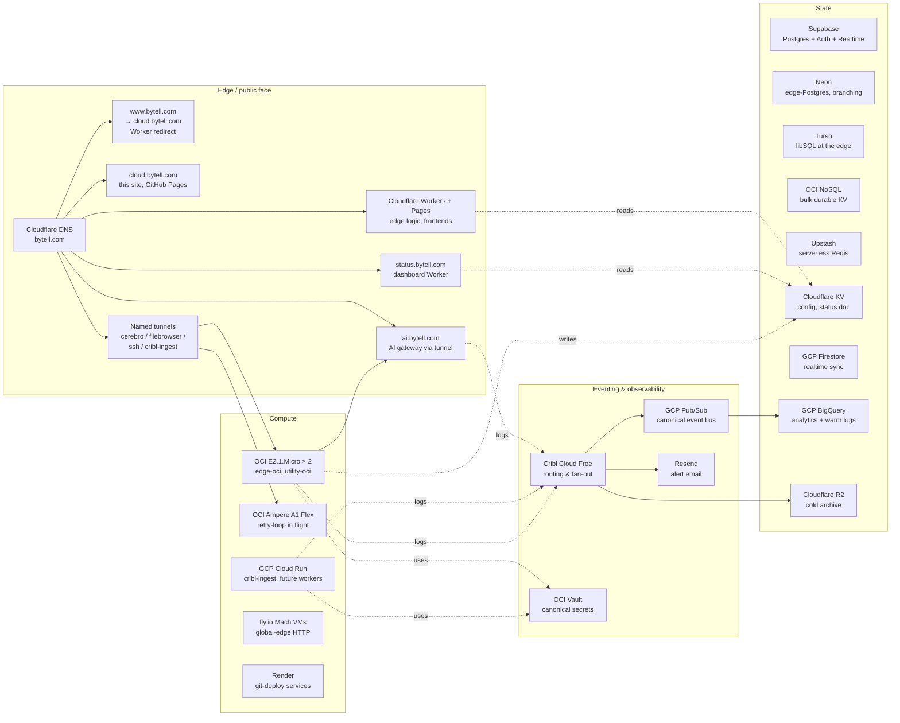

# Infrastructure overview

A deliberately wide multi-cloud footprint, each provider used only for its
strongest free-tier surface. The picture below is the **eventual** state
once the in-flight provisioning issues land; the **status** column flags
what's already up vs. what's coming.

## Topology

> **Status legend**: solid arrows indicate paths that are live as of
> 2026-05-01 unless flagged "in flight" in the role table below.

## Per-provider role and current status

### Compute

| Provider | Role | Status |
|---|---|---|
| **OCI** (Phoenix) | Always-on home-base compute. 2 × E2.1.Micro (`edge-oci`, `utility-oci`); Ampere ARM A1.Flex landing via retry loop. Hosts the AI gateway, status aggregator, future cribl-edge. | ✅ AMD micros live; Ampere loop in flight |
| **GCP Cloud Run** | Stateless HTTP workloads. Currently the **`cribl-ingest`** bridge (Cribl webhook → Pub/Sub → BigQuery). Workload identity, no JSON keys. | 🔧 Cribl-ingest service authored; awaiting deploy |
| **Cloudflare Workers** | Edge logic — redirects, dashboard SSR, status page. 100K req/day free. | ✅ Live (redirect Worker, status dashboard staged) |
| **Cloudflare Pages** | Frontends — when needed, currently no app hosted | 🟡 Available, unused |
| **fly.io** | Globally-distributed Mach VMs for latency-sensitive HTTP and persistent connections. ~$5/mo trial credit ≈ 3 micro Machines pinned. | 🔧 Issue 036 — provisioning pending |
| **Render** | Fargate-like git-deploy. Used for cold-start-tolerant workloads + Static Sites; sleeping web services not used in latency-sensitive paths. | 🔧 Issue 038 |

### State (relational)

| Provider | Role | Status |
|---|---|---|
| **Supabase** | Postgres + Auth + Realtime + Storage. Default home for app data needing RLS-driven row security or realtime UI. | 🔧 Issue 037 |
| **Neon** | Postgres with **branching** + edge driver (works from CF Workers via HTTPS). For migration previews and Workers-side queries. | 🔧 Issue 039 |
| **Turso** | libSQL (SQLite) replicated to multiple regions. For per-tenant DBs and read-heavy edge endpoints. | 🔧 Issue 041 |

### State (KV / NoSQL)

| Provider | Role | Status |
|---|---|---|
| **OCI NoSQL** | Bulk durable KV (75 GB / 133M ops/mo, Phoenix-only). | ⏸️ Quota = 0; Issue 021 awaiting Oracle |
| **Cloudflare KV** | Globally-replicated, eventually-consistent config; the **status aggregator** writes its rolled-up doc here. Edge-cached. | ✅ Status namespace staged (apply pending) |
| **Upstash Redis** | Serverless Redis, REST API for CF Workers. Rate limits, idempotency keys, ephemeral caches. | 🔧 Issue 040 |
| **GCP Firestore** | Realtime document sync. | ✅ Available, unused |

### Observability, eventing, secrets

| Provider | Role | Status |
|---|---|---|
| **Cribl Cloud Free** | Observability backbone — sources collect from every provider, pipelines parse and route, destinations fan out to Resend (alerts), R2 (archive), BigQuery (warm queries via Pub/Sub bridge). 1 TB/day free. | ✅ Alerts path live; archive + analytics in flight |
| **GCP Pub/Sub** | Canonical cross-service event bus. Cribl publishes via the bridge; consumers subscribe. | ✅ Topics live |
| **GCP BigQuery** | Warm-path log analytics. 30-day partitioned `events` table; `events_raw` raw-JSON landing. | ✅ Tables exist |
| **Cloudflare R2** | Cold object archive. Zero egress. | ✅ Bucket live; Cribl→R2 wiring pending Issue 035 |
| **OCI Vault** | Canonical secret store across all clouds. 150 secrets × 40 versions. | ✅ Live |
| **Resend** | Alert email out-of-band. Free tier 3000/mo, 100/day. | ✅ Live (alerts smoke-tested 2026-05-01) |

### AI

| Provider | Role | Status |
|---|---|---|
| **AI gateway** (OCI) | Internal Anthropic-API gateway with prompt caching. Service tokens for inter-service auth. | 🔧 Issue 034 — code planned |

### Edge / public face

| Subdomain | Backed by | Purpose |
|---|---|---|
| `bytell.com` / `cloud.bytell.com` | GitHub Pages (this site) | Documentation |
| `www.bytell.com` | Cloudflare Worker (redirect) | Redirects to `cloud.bytell.com` |
| `status.bytell.com` | Cloudflare Worker (status dashboard) | Live infrastructure health |
| `ai.bytell.com` | OCI tunnel → AI gateway | Internal AI inference (Access-gated) |
| `edge-oci.bytell.com` / `utility-oci.bytell.com` | OCI tunnels | SSH / admin (Access-gated) |

### Egress economics

OCI gives 10 TB/month outbound. Cloudflare R2 has zero egress. GCP charges
beyond 1 GB/month to NA. **Bulk transfer originates from OCI or R2**, never
GCP. Inter-cloud traffic uses HTTPS over the public internet — within free
egress allowances on the way out, free on the way in.

## Identity model

| Identity | Where | What it does |
|---|---|---|
| `claude@bytell.com` | Workspace | Cloud-ops account; OCI tenancy admin; GCP project owner. |
| `tim@bytell.com` | Workspace | Primary human account; receives DMARC and alert emails. |
| `terraform@bytell-claude-cloud.iam.gserviceaccount.com` | GCP | Impersonation target for all terraform; no JSON key. |
| `cribl-ingest@bytell-claude-cloud.iam.gserviceaccount.com` | GCP | Cloud Run runtime SA; publish-only on `claude-events` topic. |
| `tbynum` | GitHub | Admin of `bytell-cloud` org. |

## Source of truth

Infrastructure-as-code lives in a private workspace under `infra/` —
Terraform per provider (oci/, gcp/, cloudflare/), Cribl YAMLs, Cloud Run
sources, systemd units, scripts. Issues for cloud work are tracked locally
in `ProjectMgmt/` and referenced here when relevant.

This site is the public-facing summary, regenerated from those sources.
